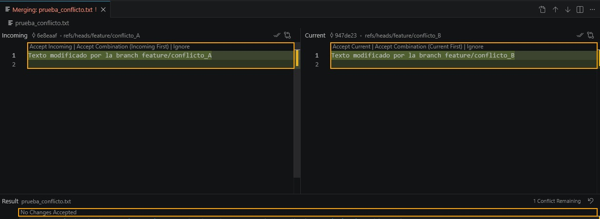
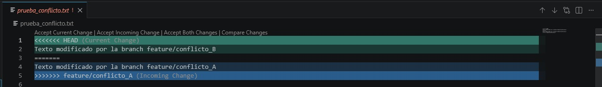
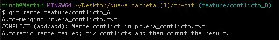
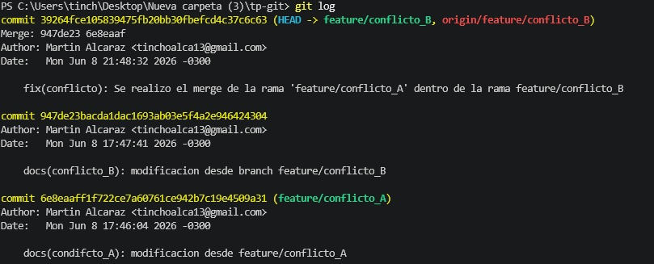

# Estadísticas del Repositorio

Este documento presenta una auditoría detallada de las métricas de desarrollo, control de cambios y colaboración del equipo en el repositorio.

---

## Métricas Generales y Control de Cambios

### 1. Mayor Cantidad de Commits por Integrante

* **Integrante:** **`Federico Heinrich`**
* **Cantidad de Commits:** **`37`**
* **Comando empleado:**
```bash
git shortlog -sn
```
>[!NOTE]
>Este comando lista de forma descendente los autores junto con la cantidad acumulada de commits que realizó cada uno.

### 2. Cantidad Total de Merges Realizados
Cantidad de Merges: 19

Comando empleado:

```bash
git log --merges --oneline
git log --merges wc -l
```
>[!NOTE]
> El primer comando filtra y muestra únicamente los commits de fusión en una sola línea, mientras que wc -l cuenta el total de renglones recibidos para obtener el número exacto.

> El segundo comando no funciona en Powershell, solo en Terminal WSL o Bash.


### 3. Cantidad de Conflictos Producidos
Cantidad de Conflictos: 1

Comando empleado:

```bash
git log --grep="Conflict" --oneline | wc -l
```

>[!NOTE]
>Filtra los commits del historial cuyos mensajes contienen la palabra "Conflict" de forma explícita, contabilizando el total general.

>No funciona en Powershell, solo en Terminal WSL o Bash.

### 4. Cantidad de Ramas Existentes en el Repositorio
Cantidad de Ramas: 23

Comandos empleados:

```bash
git branch -a
git branch -a | grep -v "remotes/origin/HEAD" | wc -l
```

>[!NOTE]
> `git branch -a` lista todas las ramas (tanto locales como remotas). Al filtrar con `grep -v`, restamos los punteros de referencia administrativos para quedarnos únicamente con la cantidad real de ramas de trabajo creadas.

> El segundo comando no funciona en Powershell, solo en Terminal WSL o Bash.

## Análisis de Impacto y Conflictos Históricos
### 5. Commit con Mayor Cantidad de Archivos Modificados

Hash del Commit: **`0353831`**

Cantidad de Archivos Involucrados: 9

Comando empleado para descubrir el commit con más cambios:
```bash
git log --all --pretty=format:"%H" | while read commit; do echo "$(git diff-tree --no-commit-id --name-only -r $commit | wc -l) $commit"; done | sort -rn | head -n 1
```

Comando empleado para auditar el impacto:

```bash
git show 0353831 --stat
```
>[!NOTE]
>El flag (--stat) nos da un desglose específico de los archivos modificados en ese commit y un recuento de las líneas alteradas sin volcar todo el código fuente en la terminal.

## Captura del Diff correspondiente a los cambios:

### 6. Conflicto Previo a su Resolución
* **Hash del Commit Asociado (Merge de conflicto):** `947de23` y `6e8eaaf`

* **Captura de la Interfaz de Fusión (3-Way Merge de VS Code):**

  
* **Captura del Conflicto (Marcadores de Git en el código):**  

  

* **Evidencia en Consola:**

  

* **Resolucion en consola:**

  
